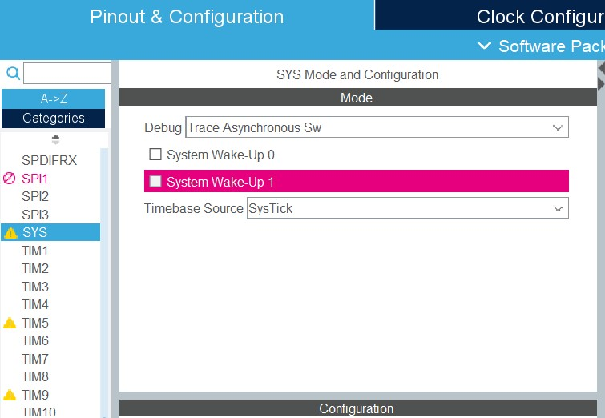
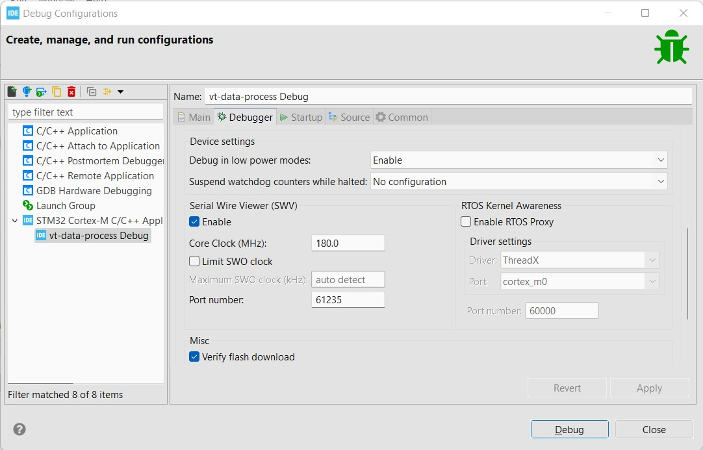
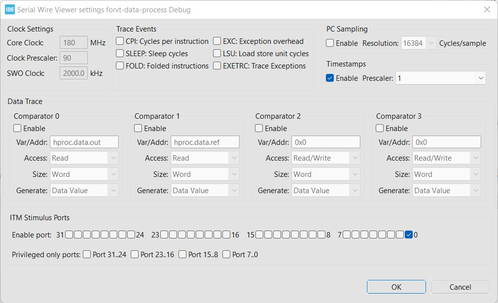
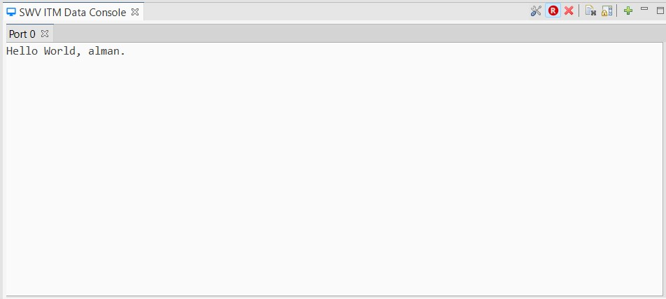

# STM32F4xx HAL SWO Module

## How to use the module
1. Make sure to connect SWO Pin (PB3) to your ST-Link downloader.

2. (STM32CubeMX) Select "Trace Asynchronous Sw" in Debug Mode.


3. (STM32CubeIDE) Enable Serial Wire Viewer (SWV) in debugger configuration, and make sure the Core Clock is same with SYSCLK.


4. (STM32CubeIDE) Enable ITM port 0 in SWV settings.


5. (STM32CubeIDE) Start trace by pressiong R red button.


#### **`main.c`**

```c
#include "stm32f4xx-hal-swo/swo.h"

int main(void)
{
  /* (Option 1) Initialize SWO using ITM */
  SWO_Init(NULL);
  
  /* (Option 2) Initialize SWO using UART */
  MX_USART2_UART_Init();
  SWO_Init(&huart2);

  /* Super loop */
  while(1) {
    /* Use stdio from c library */
    printf("Hello World, alman.\r\n");
  }
}
```
